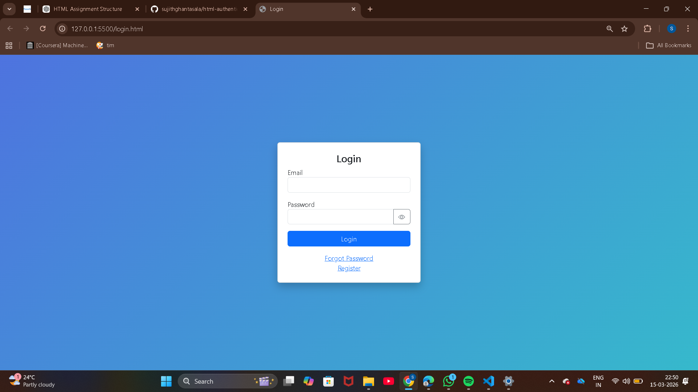
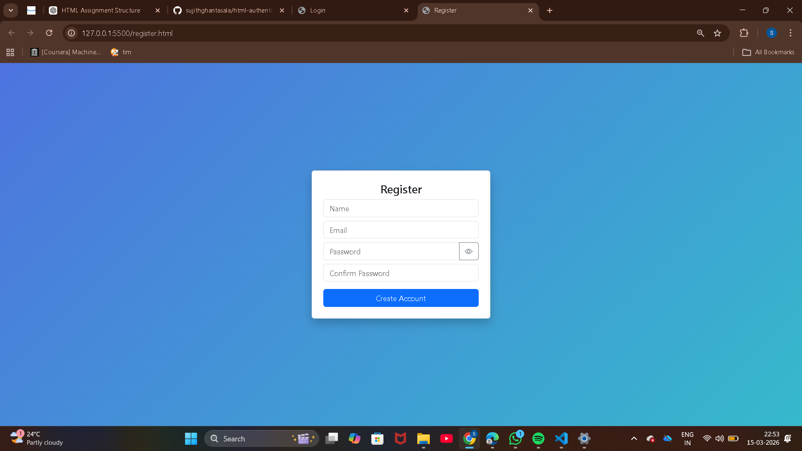
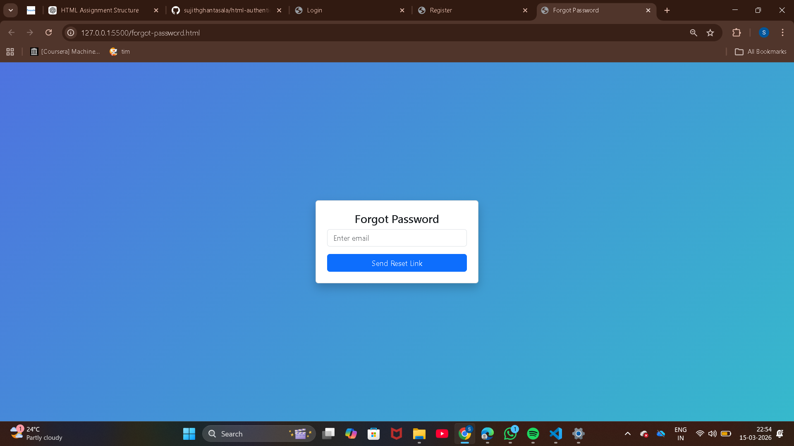
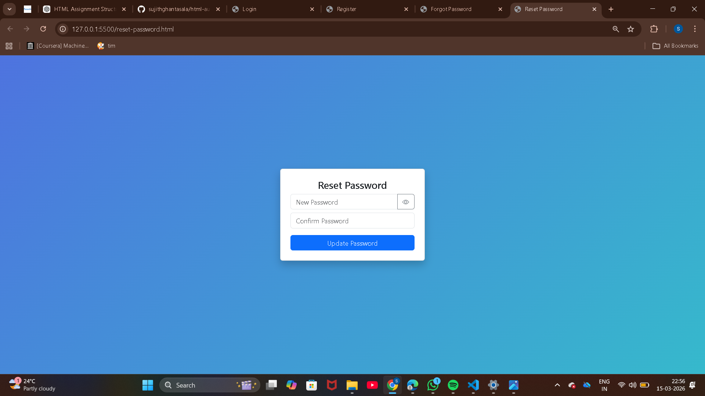
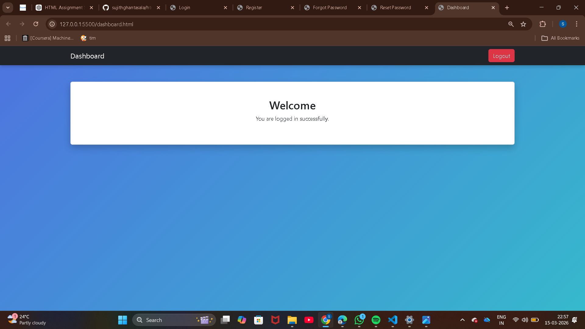

# Authentication System Styled

This project is a **responsive authentication UI** built using **HTML, Bootstrap 5, and custom CSS**.
It simulates a basic authentication workflow including login, registration, password recovery, and a dashboard interface.

The goal of this assignment was to transform plain HTML authentication pages into a **professional, responsive, and visually styled application** using Bootstrap components and custom styling.

---

## Pages Included

* **login.html** – User login page
* **register.html** – New user registration page
* **forgot-password.html** – Password recovery page
* **reset-password.html** – Reset password form
* **dashboard.html** – Simple dashboard after login

---

## Technologies Used

* HTML5
* Bootstrap 5 (CDN)
* Bootstrap Icons
* Custom CSS
* Google Fonts

---

## Features

* Bootstrap **cards, forms, and buttons**
* **Responsive layout** for desktop, tablet, and mobile
* **Custom CSS styling**
* Google Fonts integration
* Password **show/hide toggle**
* Password **strength indicator**
* Navigation between authentication pages
* Simple dashboard layout with **navbar and logout button**

---

## Project Structure

authentication-system-styled/

login.html
register.html
forgot-password.html
reset-password.html
dashboard.html
styles.css
README.md

screenshots/
    login.png
    register.png
    forgot-password.png
    reset-password.png
    dashboard.png

---

## Screenshots

### Login Page



### Registration Page



### Forgot Password Page



### Reset Password Page



### Dashboard Page



---

## How to Run

1. Clone the repository

```
git clone https://github.com/sujithghantasala/html-authentication-poc.git
```

2. Open the project folder

3. Open **login.html** in a browser

4. Navigate between pages using the provided links

---

## Author

Sujith Ghantasala
